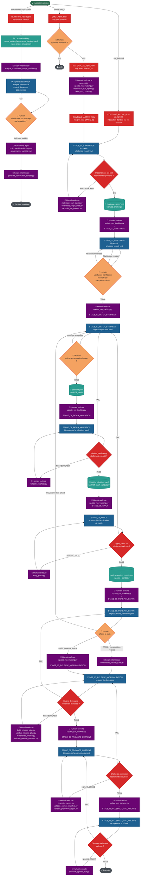

# Pipeline Constitution — Flowchart

```mermaid
flowchart TD
    START([▶ Invocation pipeline]):::start

    START -->|run_id fourni| CONT["CONTINUE_ACTIVE_RUN / INSPECT\nRésolution d'entrée sur run existant"]:::decision
    START -->|pas de run_id| OPEN["OPEN_NEW_RUN\nDécision d'entrée"]:::decision
    START -->|maintenance optionnelle| PART0["PARTITION_REFRESH\nRévision de partition"]:::decision

    %% ─── PARTITION REFRESH ───
    PART0 --> GB["📚 Lecture backlog\nscope_catalog/governance_backlog.yaml\n(open entries en premier)"]:::output
    GB --> PS1["🧪 Script déterministe\nanalyze_constitution_scope_partition.py"]:::script
    PS1 --> IA0["IA : synthèse backlog + analyse sémantique\nà partir du rapport déterministe"]:::skill
    IA0 --> PH1{🧑 Humain\nclarification ou arbitrage\nsur la partition ?}:::human
    PH1 -->|Oui| IA0
    PH1 -->|Décision validée| POL["🧑 Humain met à jour\npolicy.yaml / decisions.yaml\n+ governance_backlog.yaml"]:::script
    POL --> PS2["🧪 Script déterministe\ngenerate_constitution_scopes.py"]:::script
    PS2 --> ZPART([✅ Partition republiée]):::stop
    
    %% ─── ENTRY : NO RUN_ID ───
    OPEN --> H1{🧑 Humain\nconfirme ouverture ?}:::human
    H1 -->|Non| ABORT([⛔ Arrêt]):::stop
    H1 -->|Oui| MAT["MATERIALIZE_NEW_RUN\nstop avant STAGE_01"]:::decision
    MAT --> SBOOT["🧑 Humain exécute si nécessaire\nupdate_run_tracking.py\nmaterialize_run_inputs.py\nbuild_run_context.py"]:::script
    SBOOT --> CONT0["CONTINUE_ACTIVE_RUN\nrun prêt pour STAGE_01"]:::decision

    %% ─── STAGE 01 ───
    CONT --> S01
    CONT0 --> S01
    S01["STAGE_01_CHALLENGE\nIA produit challenge_report*.md"]:::skill
    S01 --> D01{Préconditions ids-first\nréellement disponibles ?}:::decision
    D01 -->|Non / BLOCKED| B01["🧑 Humain exécute\nmaterialize_run_inputs.py\nou extract_scope_slice.py\nou build_run_context.py"]:::script
    B01 --> S01
    D01 -->|Oui| R1[("📄 challenge_report*.md\nwork/01_challenge/")]:::output
    R1 --> T01["🧑 Humain exécute\nupdate_run_tracking.py\n→ STAGE_02_ARBITRAGE"]:::script
    T01 --> S02

    %% ─── STAGE 02 ───
    S02["STAGE_02_ARBITRAGE\nIA produit arbitrage_report_<id>.md"]:::skill
    S02 --> H2{🧑 Humain\nvalidation, clarification\nou arbitrage complémentaire ?}:::human
    H2 -->|Clarification requise| S02
    H2 -->|Révision demandée| S02
    H2 -->|Validé| T02["🧑 Humain exécute\nupdate_run_tracking.py\n→ STAGE_03_PATCH_SYNTHESIS"]:::script
    T02 --> S03

    %% ─── STAGE 03 ───
    S03["STAGE_03_PATCH_SYNTHESIS\nIA produit patchset.yaml"]:::skill
    S03 --> H3{🧑 Humain\nvalide ou demande révision ?}:::human
    H3 -->|Révision demandée| S03
    H3 -->|Validé| R2[("📄 patchset.yaml\nwork/03_patch/")]:::output
    R2 --> T03["🧑 Humain exécute\nupdate_run_tracking.py\n→ STAGE_04_PATCH_VALIDATION"]:::script
    T03 --> S04

    %% ─── STAGE 04 ───
    S04["STAGE_04_PATCH_VALIDATION\nIA supervise la validation patch"]:::skill
    S04 --> D04{validate_patchset.py\nréellement exécuté ?}:::decision
    D04 -->|Non / BLOCKED| B04["🧑 Humain exécute\nvalidate_patchset.py"]:::script
    B04 --> S04
    D04 -->|FAIL| S03
    D04 -->|PASS| R4[("📄 patch_validation.yaml\nwork/04_patch_validation/")]:::output
    R4 --> T04["🧑 Humain exécute\nupdate_run_tracking.py\n→ STAGE_05_APPLY"]:::script
    T04 --> S05

    %% ─── STAGE 05 ───
    S05["STAGE_05_APPLY\nIA supervise l'application du patch"]:::skill
    S05 --> D05{apply_patch.py\nréellement exécuté ?}:::decision
    D05 -->|Non / BLOCKED| B05["🧑 Humain exécute\napply_patch.py"]:::script
    B05 --> S05
    D05 -->|FAIL| S03
    D05 -->|PASS| R5[("📄 patch_execution_report.yaml\nreports/ + sandbox/")]:::output
    R5 --> T05["🧑 Humain exécute\nupdate_run_tracking.py\n→ STAGE_06_CORE_VALIDATION"]:::script
    T05 --> S06
    
    %% ─── STAGE 06 ───
    S06["STAGE_06_CORE_VALIDATION\nIA produit core_validation.yaml"]:::skill
    S06 --> H6{🧑 Humain\nchoisit la suite}:::human
    H6 -->|FAIL / correction amont| S03
    H6 -->|PASS + consolidation requise| C06B["🧪 Script déterministe\nconsolidate_parallel_runs.py"]:::script
    H6 -->|PASS + release directe| T06["🧑 Humain exécute\nupdate_run_tracking.py\n→ STAGE_07_RELEASE_MATERIALIZATION"]:::script
    C06B --> S07
    T06 --> S07

    %% ─── STAGE 07 ───
    S07["STAGE_07_RELEASE_MATERIALIZATION\nIA supervise la release"]:::skill
    S07 --> D07{Chaîne de release\nréellement exécutée ?}:::decision
    D07 -->|Non / BLOCKED| R07["🧑 Humain exécute\nbuild_release_plan.py\nvalidate_release_plan.py\nmaterialize_release.py\nvalidate_release_manifest.py"]:::script
    R07 --> S07
    D07 -->|FAIL| S06
    D07 -->|PASS| T07["🧑 Humain exécute\nupdate_run_tracking.py\n→ STAGE_08_PROMOTE_CURRENT"]:::script
    T07 --> S08

    %% ─── STAGE 08 ───
    S08["STAGE_08_PROMOTE_CURRENT\nIA supervise la promotion current"]:::skill
    S08 --> D08{Chaîne de promotion\nréellement exécutée ?}:::decision
    D08 -->|Non / BLOCKED| R08["🧑 Humain exécute\npromote_current.py\nvalidate_current_manifest.py\nvalidate_promotion_report.py"]:::script
    R08 --> S08
    D08 -->|FAIL| S07
    D08 -->|PASS| T08["🧑 Humain exécute\nupdate_run_tracking.py\n→ STAGE_09_CLOSEOUT_AND_ARCHIVE"]:::script
    T08 --> S09

    %% ─── STAGE 09 ───
    S09["STAGE_09_CLOSEOUT_AND_ARCHIVE\nIA supervise la clôture"]:::skill
    S09 --> D09{Closeout réellement\nexécuté ?}:::decision
    D09 -->|Non / BLOCKED| R09["🧑 Humain exécute\ncloseout_pipeline_run.py"]:::script
    R09 --> S09
    D09 -->|FAIL| S08
    D09 -->|PASS| OK([✅ Run clos]):::stop

    %% ─── STYLES ───
    classDef start fill:#2d6a4f,color:#fff,stroke:#1b4332
    classDef stop fill:#495057,color:#fff,stroke:#343a40
    classDef skill fill:#1e6091,color:#fff,stroke:#0d3b66
    classDef script fill:#6a0572,color:#fff,stroke:#4a0050
    classDef decision fill:#d62828,color:#fff,stroke:#9b1b1b
    classDef human fill:#f4a261,color:#222,stroke:#e76f51,stroke-width:2px
    classDef output fill:#2a9d8f,color:#fff,stroke:#1a7066
```