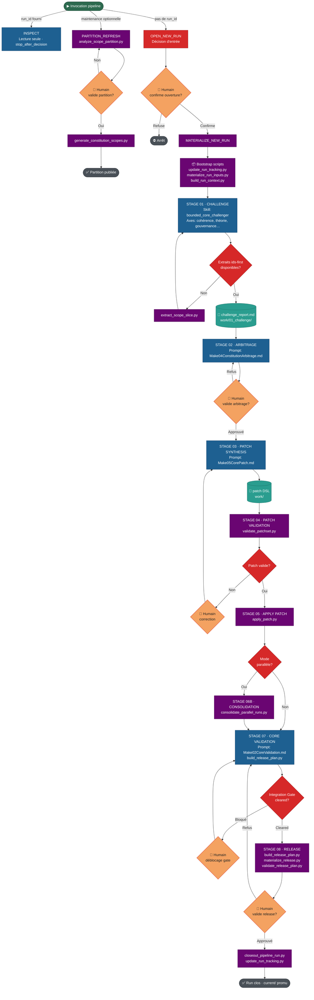

# Pipeline Constitution — Flowchart

```mermaid
flowchart TD
    START([▶ Invocation pipeline]):::start

    START -->|run_id fourni| INSPECT[INSPECT\nLecture seule · stop_after_decision]:::skill
    START -->|pas de run_id| OPEN[OPEN_NEW_RUN\nDécision d'entrée]:::decision
    START -->|maintenance optionnelle| PART[PARTITION_REFRESH\nanalyze_scope_partition.py]:::script

    %% ─── PARTITION REFRESH ───
    PART --> H_PART{🧑 Humain\nvalide partition?}:::human
    H_PART -->|Oui| GEN[generate_constitution_scopes.py]:::script
    H_PART -->|Non| PART
    GEN --> Z2([✅ Partition publiée]):::stop

    %% ─── ENTRY : NO RUN_ID ───
    OPEN --> H1{🧑 Humain\nconfirme ouverture?}:::human
    H1 -->|Refuse| ABORT([⛔ Arrêt]):::stop
    H1 -->|Confirme| MAT[MATERIALIZE_NEW_RUN]:::script
    MAT --> SBOOT["📦 Bootstrap scripts\nupdate_run_tracking.py\nmaterialize_run_inputs.py\nbuild_run_context.py"]:::script

    SBOOT --> S01

    %% ─── STAGE 01 ───
    S01["STAGE 01 · CHALLENGE\nSkill: bounded_core_challenger\nAxes: cohérence, théorie, gouvernance…"]:::skill
    S01 --> D_IDS{Extraits ids-first\ndisponibles?}:::decision
    D_IDS -->|Non| EXT[extract_scope_slice.py]:::script
    EXT --> S01
    D_IDS -->|Oui| R1[("📄 challenge_report.md\nwork/01_challenge/")]:::output
    R1 --> S02

    %% ─── STAGE 02 ───
    S02["STAGE 02 · ARBITRAGE\nPrompt: Make04ConstitutionArbitrage.md"]:::skill
    S02 --> H2{🧑 Humain\nvalide arbitrage?}:::human
    H2 -->|Refus| S02
    H2 -->|Approuvé| S03

    %% ─── STAGE 03 ───
    S03["STAGE 03 · PATCH SYNTHESIS\nPrompt: Make05CorePatch.md"]:::skill
    S03 --> R2[("📄 patch DSL\nwork/")]:::output
    R2 --> S04

    %% ─── STAGE 04 ───
    S04["STAGE 04 · PATCH VALIDATION\nvalidate_patchset.py"]:::script
    S04 --> D_VAL{Patch valide?}:::decision
    D_VAL -->|Non| H3{🧑 Humain\ncorrection}:::human
    H3 --> S03
    D_VAL -->|Oui| S05

    %% ─── STAGE 05 ───
    S05["STAGE 05 · APPLY PATCH\napply_patch.py"]:::script
    S05 --> D_PAR{Mode\nparallèle?}:::decision
    D_PAR -->|Oui| S06B["STAGE 06B · CONSOLIDATION\nconsolidate_parallel_runs.py"]:::script
    D_PAR -->|Non| S07
    S06B --> S07

    %% ─── STAGE 07 ───
    S07["STAGE 07 · CORE VALIDATION\nPrompt: Make02CoreValidation.md\nbuild_release_plan.py"]:::skill
    S07 --> D_GATE{Integration Gate\ncleared?}:::decision
    D_GATE -->|Bloqué| H4{🧑 Humain\ndéblocage gate}:::human
    H4 --> S07
    D_GATE -->|Cleared| S08

    %% ─── STAGE 08 ───
    S08["STAGE 08 · RELEASE\nbuild_release_plan.py\nmaterialize_release.py\nvalidate_release_plan.py"]:::script
    S08 --> H5{🧑 Humain\nvalide release?}:::human
    H5 -->|Refus| S07
    H5 -->|Approuvé| CLO["closeout_pipeline_run.py\nupdate_run_tracking.py"]:::script
    CLO --> OK([✅ Run clos · current/ promu]):::stop

    %% ─── STYLES ───
    classDef start fill:#2d6a4f,color:#fff,stroke:#1b4332
    classDef stop fill:#495057,color:#fff,stroke:#343a40
    classDef skill fill:#1e6091,color:#fff,stroke:#0d3b66
    classDef script fill:#6a0572,color:#fff,stroke:#4a0050
    classDef decision fill:#d62828,color:#fff,stroke:#9b1b1b
    classDef human fill:#f4a261,color:#222,stroke:#e76f51,stroke-width:2px
    classDef output fill:#2a9d8f,color:#fff,stroke:#1a7066
```
